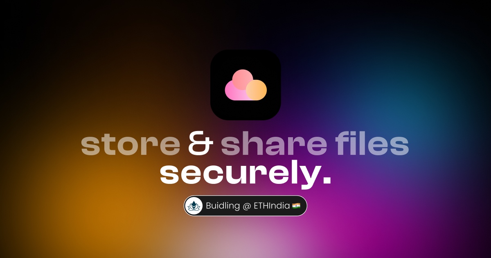

  
    
  
  
  

 

# 🚀 Storehouse beta

Secure cloud storage on-chain leveraging IPFS with better UX

Demo: https://0xstorehouse.vercel.app

## 💡 The Idea

In this modern world of technology, our data is in the hands of many big companies. Web 3.0 introduces the concept of decentralisation, in short, the flow and storage of data, without the need of any central authority.

And Storehouse is based on the idea of decentralisation to make the most secure personal storage for one.

Leveraging the use-cases of IPFS at the same time, we can enable users to depend on IPFS as their cloud storage platform through Storehouse. Storehouse makes an easy interface for users to upload their encrypted files on IPFS and serving it as their cloud storage on-chain.

## ⭐ Features

- Store any kind of file in a seemlessly easy way on Polygon.
- Dont worry about data piracy, your files are end-to-end encrypted
- Share your files between other users on chain
- Based on blockchain technology

## 🌠 Uses

- NextJS [Frontend Framework]
- Chakra UI [UI Framework]
- Polygon
- IPFS / Filecoin
- ENS
- Push Protocol
- Infura
- Thirdweb
- External Javascript Libraries

## Contracts

Storehouse https://mumbai.polygonscan.com/address/0xc64a998AB01e1401181726cfd55831b9648fB522
